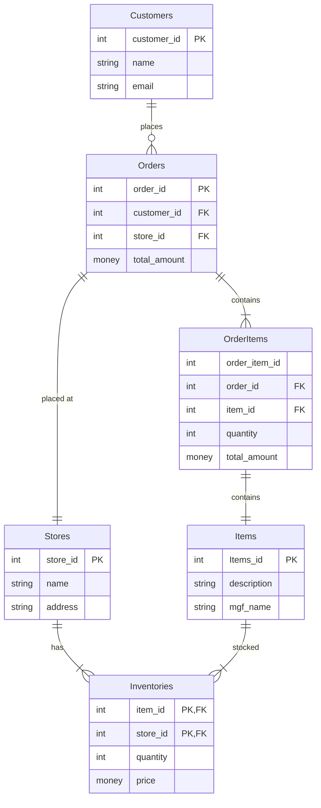

# Entity Relationship Diagram

```mermaid
erDiagram
%% Auto Parts Database

    Customers {
        int customer_id PK
        string name
        string email
    }
    Items {
        int Items_id PK
        string description
        string mgf_name
    }
    Inventories {
        int item_id PK,FK
        int store_id PK,FK
        int quantity
        money price
    }
    Stores {
       int store_id PK
       string name
       string address
    }
    Orders {
       int order_id PK
       int customer_id FK
       int store_id FK
       money total_amount
    }
    OrderItems {
        int order_item_id
        int order_id FK
        int item_id FK
        int quantity
        money total_amount
    }

    Stores ||--|{ Inventories : has
    Items ||--|{ Inventories : stocked
    Customers ||--o{ Orders : places
    Orders ||--|{ OrderItems : contains
    OrderItems ||--|| Items : contains
    Orders ||--|| Stores : "placed at"

```
